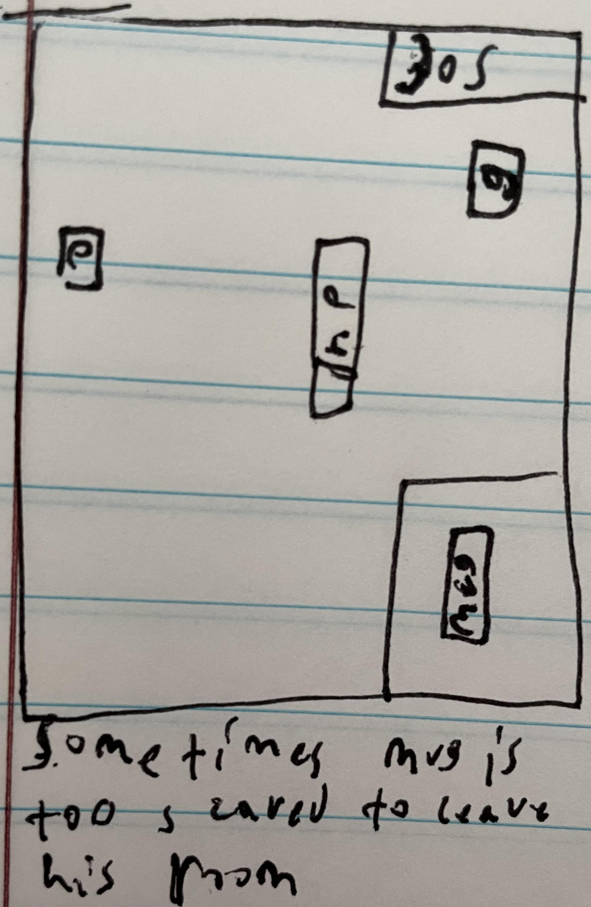
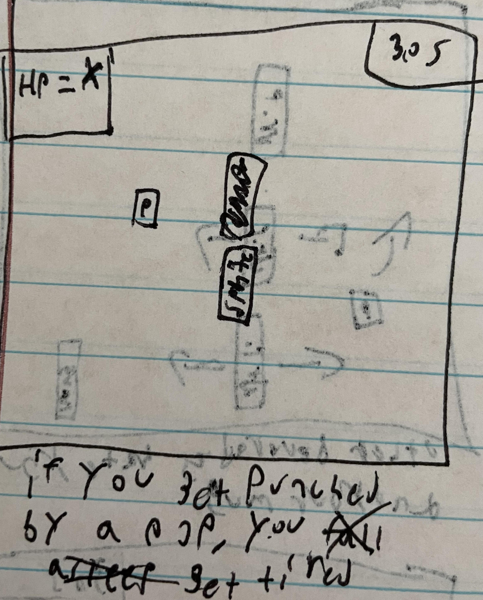

# Shanes-Game-Project
A repo for shanes first game project
--a day in the life of an average mug enjoyer--

# H1 A DAY IN THE LIFE OF THE AVERAGE MUG ENJOYER

# horizontal rule
1. display start screen and be able to start the game using a key press
2. player will be able to move and punch
3. colliding with enemys will remove health 
4. when health is 0 it will display gamer over
5. when you get the mug it will take you to the next level
6. there will be at least 3 levels
7. there will be a timer that will end the game if it reaches 0
8. you'll need to collect the glove to be able to punch
9. some levels you will need to punch the beverages before being able to get mug
# horizontal rule

-as a mug enjoyer you need to drink mug to survive-
the goal of the game is to collect the mug

# horizontal rule

-other beverages hate you and your mug-
the enemies in the game are other beverages

# horizontal rule

-you don't want to hurt your hands punching a bottle-
you can't punch without picking up the glove

# horizontal rule

-you can punch the pops to save your mug-
sometimes you can't always run from the beverages so you need to fight

# horizontal rule

-sometimes mug is too scared to leave his room-
if you don't punch the pops in the room you wont be able to get the mug

# horizontal rule

-if you don't rescue mug before he's flat, he will die-
implementing a timer so it adds a layer of difficulty to the game

# horizontal rule

-if you get punched by a beverage, you get tired-
the beverages will hurt you if they touch you and you dont have a glove to punch them

# horizontal rule

-get too tired and you'll fall asleep(game over)-
if you get hit too many times the game will end

# horizontal rule

-fall asleep potential game over screen-
potential screen for game over

# horizontal rule

-potential mug flat screen-
potential screen for game over

# horizontal rule

-potential start screen-
potential start screen will include the directions and a brief description