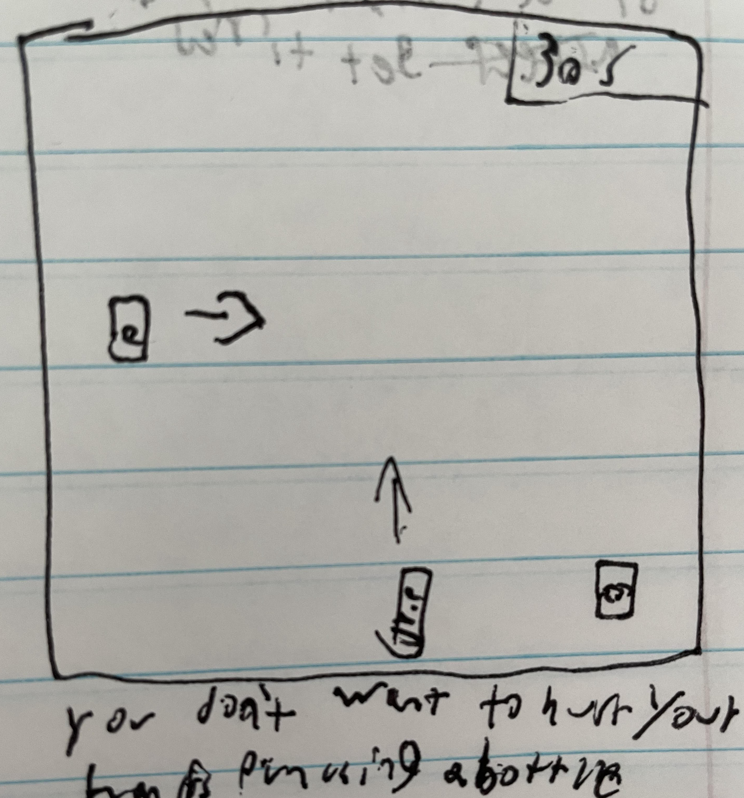
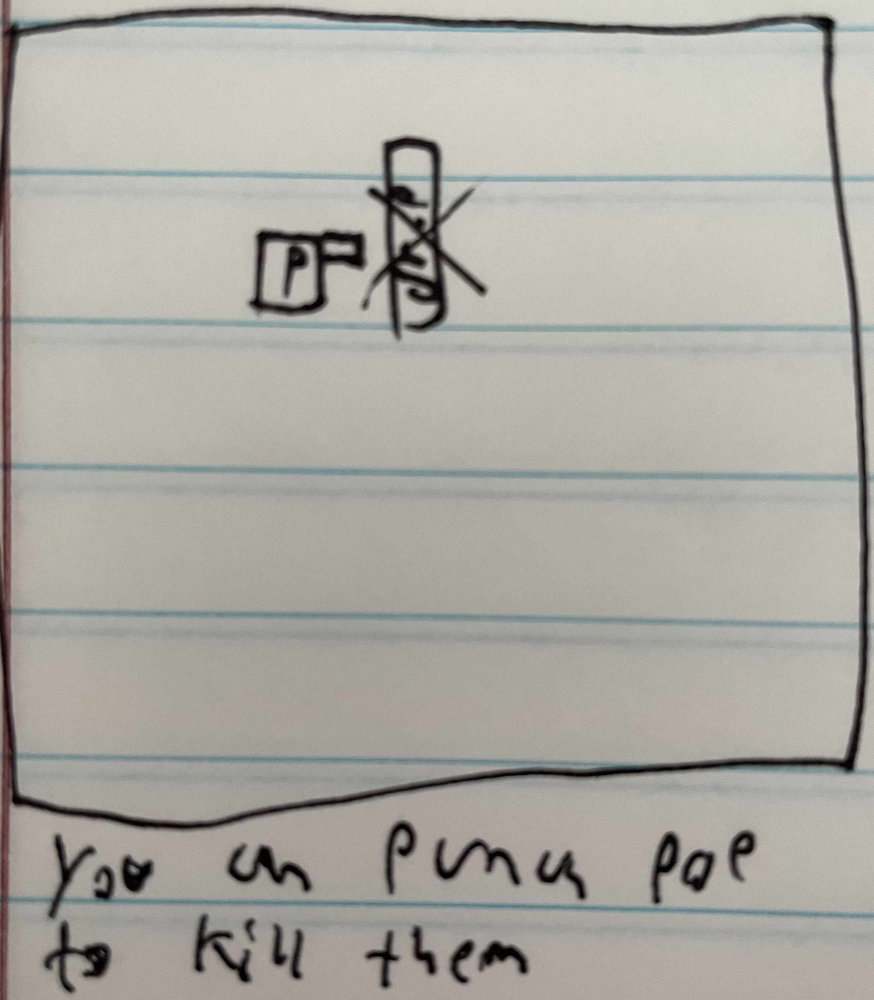

# Shanes-Game-Project
A repo for shanes first game project
--a day in the life of an average mug enjoyer--

# A DAY IN THE LIFE OF THE AVERAGE MUG ENJOYER
## Game Description
a day in the life of an average mug enjoyer is just a simulation of the day to day life of a mug enthusiast. You must rescue your mug from the clutches of dr.pepper and sprite before they let your mug go flat. 
---
1. I want to be able to start the game with a key press
2. I want to be able to use the wasd keys to move the player
3. I want to be able to display a health bar which reflects damage taken 
4. I want to be able to display a game over screen when health is 0
5. I want to be able to advance to the next level upon collection of the mug
6. I want to be able to display a game over screen when the timer to retrieve mug runs to 0
7. I want to be able to pick up a glove and be able to delete dr pepper by punching him
---

-visual of the player display-
this will be what the game board will look like
---

-as a mug enjoyer you need to drink mug to survive-
the goal of the game is to collect the mug

---

-other beverages hate you and your mug-
the enemies in the game are other beverages

---

-you don't want to hurt your hands punching a bottle-
you can't punch without picking up the glove

---

-you can punch the pops to save your mug-
sometimes you can't always run from the beverages so you need to fight

---

-sometimes mug is too scared to leave his room-
if you don't punch the pops in the room you wont be able to get the mug

---

-if you don't rescue mug before he's flat, he will die-
implementing a timer so it adds a layer of difficulty to the game

---

-if you get punched by a beverage, you get tired-
the beverages will hurt you if they touch you and you dont have a glove to punch them

---

-get too tired and you'll fall asleep(game over)-
if you get hit too many times the game will end

---

-fall asleep potential game over screen-
potential screen for game over

---

-potential mug flat screen-
potential screen for game over

---

-visual of the player display-
this will be what the game board will look like